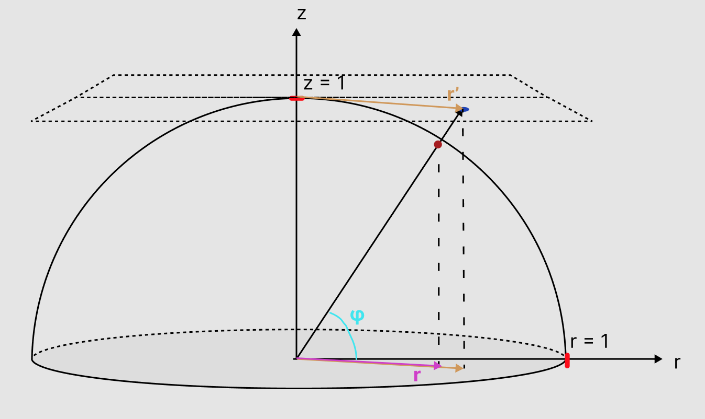

# Processamento de Imagem

# O plano projetivo no modelo circular de P1

Para resolver o problema proposto de fazer o mapeamento de 4 pontos arbitrários é necessário realizar dois passos, o primeiro é mapear o modelo circular para um plano, após isso é necessário fazer um mapeamento do plano gerado pelo modelo circular de volta para o plano original. Para realizar essa conversão utilizando uma esfera de raio 1, a ideia é construir a partir do seguinte modelo:

uma vez que isso está definido podemos partir para a representação algébrica desse modelo (uma vez que a angulação nos planos é exatamente a mesma ela não interessa no modelo que vamos calcular):

$$
cos(\phi) = \frac{r}{1} = r
$$

$$
tg(\phi) = \frac{1}{r'}
$$

Para relacionar os dois valores é possível partir de:

$$
tg^2 \phi = \frac{sin^2 \phi}{cos^2 \phi} = \frac{1 - cos^2 \phi}{cos^2 \phi}
$$

Que pode ser relacionado por:

$$
\frac{1}{r'^2} = \frac{1 - r^2}{r^2}
$$

que pode ser reduzido fazendo:

$$
r' = ± r\sqrt{\frac{1}{1 - r^2}}
$$

Os sinais indicam que a expansão da reta poderia cruzar um plano acima e um plano abaixo da esfera.

Para encontrar a relação de multiplicação que pode ser aplicada as coordenadas originais uma vez que:

$$
r' = \lambda r = \sqrt{\lambda^2x^2 + \lambda^2 y^2}
$$

o resultado é dado por:

$$
\lambda = \sqrt{\frac{1}{1 - r^2}}
$$

Isso pode ser aplicado as coordenadas para encontrar a relação direta entre as coordenadas da esfera em um plano com z = 1.

De posse dessa transformação é possível partir de um plano projetivo do modelo circular para um plano projetivo euclidiano normal, então para encontrar a relação de fazer com que seja possível o equivalente ao seguinte desenho:

É necessário fazer a correlação entre $\alpha_1$(plano original) e o plano $\alpha_2$ descrito por $c$. Para realizar isso é necessário aplicar a transformação dada pelos valores calculados pela equação (1) e realizar uma transformação de $c$ em $\alpha_2$ para encontrar o mapeamento $H$ a seguir:

$$
H: \alpha_2 \rightarrow \alpha_1
$$

Para a transformação da matriz do tipo:

$$
H = \begin{pmatrix}
h_{11} & h_{12} & h_{13} \\
h_{21} & h_{22} & h_{23} \\
h_{31} & h_{32} & 1
\end{pmatrix}
$$

A transformação é dada claramente por:

$$
\begin{pmatrix}
x' \\
y' \\
z'
\end{pmatrix} = \begin{pmatrix}
h_{11} & h_{12} & h_{13} \\
h_{21} & h_{22} & h_{23} \\
h_{31} & h_{32} & 1
\end{pmatrix} \cdot
\begin{pmatrix}
x \\
y \\
1
\end{pmatrix}
$$

A redução resulta em uma expressão dada por:

$$
\begin{pmatrix}
x' \\
y' \\
z'
\end{pmatrix} = \begin{pmatrix}
xh_{11} + yh_{12} + h_{13} \\
xh_{21} + yh_{22} + h_{23} \\
xh_{31} + yh_{32} + h_{33}
\end{pmatrix}
$$

Onde para cada ponto pode-se reduzir para coordenadas homogêneas os representantes ao tomar:

$$
\begin{cases}
x'' = \frac{xh_{11} + yh_{12} + h_{13}}{xh_{31} + yh_{32} + 1} \\
\\
y'' = \frac{xh_{21} + yh_{22} + h_{23}}{xh_{31} + yh_{32} + 1}
\end{cases}
$$

Ao resolver essa expressão com 4 pontos é possível calcular a matriz de conversão com cada h, i.e. precisamos resolver o sistema que pode ser descrito por:

$$
\begin{cases}
x_1h_{11} + y_1h_{12} + h_{13} + 0h_{21} + 0h_{22} +0h_{23} -x_1'' x_1 h_{31} - x_1''y_1 h_{32} = x_1'' \\
0h_{11} + 0h_{12} +0h_{13} + x_1 h_{21} + y_1 h_{22} + h_{23}- y_1'' x_1 h_{31} - y_1''y_1 h_{32} = y_1'' \\
x_2 h_{11} + y_2 h_{12} + h_{13} + 0h_{21} + 0h_{22} +0h_{23} -x_2'' x_2 h_{31} - x_2''y_2 h_{32} = x_2'' \\
0h_{11} + 0h_{12} +0h_{13} + x_2 h_{21} + y_2 h_{22} + h_{23}- y_2'' x_2 h_{31} - y_2''y_2 h_{32} = y_2'' \\
x_3 h_{11} + y_3 h_{12} + h_{13} + 0h_{21} + 0h_{22} +0h_{23} -x_3'' x_3 h_{31} - x_3''y_3 h_{32} = x_3'' \\
0h_{11} + 0h_{12} +0h_{13} + x_3 h_{21} + y_3 h_{22} + h_{23}- y_3'' x_3 h_{31} - y_3''y_3 h_{32} = y_3'' \\
x_4 h_{11} + y_4 h_{12} + h_{13} + 0h_{21} + 0h_{22} +0h_{23} -x_4'' x_4 h_{31} - x_4''y_4 h_{32} = x_4'' \\
0h_{11} + 0h_{12} +0h_{13} + x_4 h_{21} + y_4 h_{22} + h_{23}- y_4'' x_4 h_{31} - y_4''y_4 h_{32} = y_4''
\end{cases}
$$

Dessa forma sendo construída a matriz para resolução do sistema dada por:

$$
\begin{bmatrix}
x_1 & y_1 & 1 & 0 & 0 & 0 & -x_1'' x_1 & -x_1'' y_1 & - x_1'' \\
0 & 0 & 0 & x_1 & y_1 & 1 & -y_1'' x_1 & -y_1'' y_1 & -y_1'' \\
x_2 & y_2 & 1 & 0 & 0 & 0 & -x_2'' x_2 & -x_2'' y_2 & x_2'' \\
0 & 0 & 0 & x_2 & y_2 & 1 & -y_2'' x_2 & -y_2'' y_2 & y_2'' \\
x_3 & y_3 & 1 & 0 & 0 & 0 & -x_3'' x_3 & -x_3'' y_3 & x_3'' \\
0 & 0 & 0 & x_3 & y_3 & 1 & -y_3'' x_3 & -y_3'' y_3 & y_3'' \\
x_4 & y_4 & 1 & 0 & 0 & 0 & -x_4'' x_4 & -x_4'' y_4 & x_4'' \\
0 & 0 & 0 & x_4 & y_4 & 1 & -y_4'' x_4 & -y_4'' y_4  & y_4'' \\
0 & 0 & 0 & 0 & 0 & 0 & 0 & 0 & 1
\end{bmatrix} \cdot \begin{bmatrix}
h_{11} \\
h_{12} \\
h_{13} \\
h_{21} \\
h_{22} \\
h_{23} \\
h_{31} \\
h_{32} \\
h_{33}
\end{bmatrix} = 
\begin{bmatrix}
0 \\
0 \\
0 \\
0 \\
0 \\
0 \\
0 \\
0 \\
1
\end{bmatrix}
$$

Para resolver esse sistema de equações basta realizar um escalonamento gaussiano.

Mas para resolver de fato esse problema seria necessário antes de mais nada obter o plano $\alpha_2$, para obter esse plano é necessário resolver o problema de calcular os pontos no plano a partir da esfera originária, isto é.